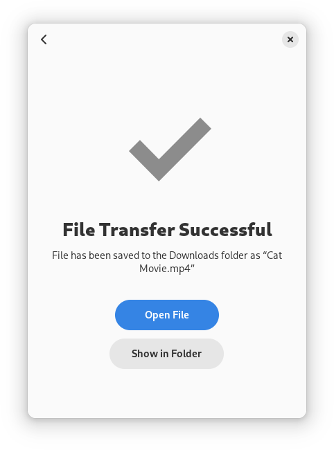

# Warp - Fast and secure file transfer

Warp allows you to securely send files to each other via the internet or local network by exchanging a word-based code.

The best transfer method will be determined using the “Magic Wormhole” protocol which includes local network transfer if possible. File transfers are encrypted.

[](https://flathub.org/apps/details/app.drey.Warp)

[](https://apps.gnome.org/app/app.drey.Warp/)

[](https://circle.gnome.org/)

## Features

* Send files between multiple devices
* Every file transfer is encrypted
* Directly transfer files on the local network if possible
* An internet connection is required
* Compatibility with the “Magic Wormhole” command line client



## Support

To receive support, you can join the matrix channel at https://matrix.to/#/#app.drey.Warp:matrix.org.

Please report issues and bugs in the issue tracker in Gitlab.

## Flatpak

Flatpak is the recommended way to build and run Warp.

### Build

Make sure you have `flatpak` and `flatpak-builder` installed. Then run the commands below.

```shell
flatpak remote-add --user --if-not-exists flathub https://dl.flathub.org/repo/flathub.flatpakrepo
flatpak install --user org.gnome.Sdk//42 org.freedesktop.Sdk.Extension.rust-stable//21.08 org.gnome.Platform//42
cd build-aux
flatpak-builder --user app app.drey.Warp.Devel.json
```

### Run

Once the project is built, run the command below.

```shell
flatpak-builder --run app app.drey.Warp.Devel.json warp
```

### Install

After installing the dependencies you can build and install with this command:

```shell
cd build-aux
flatpak-builder --install --user app app.drey.Warp.Devel.json warp --force-clean 
```

## Meson

It is supported to install the project locally without flatpak.

```shell
meson build
cd build
ninja
sudo ninja install
```

To uninstall:

```shell
cd build
ninja uninstall
```

It is required to test any big changes with flatpak before contributing any new code.

# Contributing
See the [Contribution guide](./CONTRIBUTING.md) on how to contribute to the project
