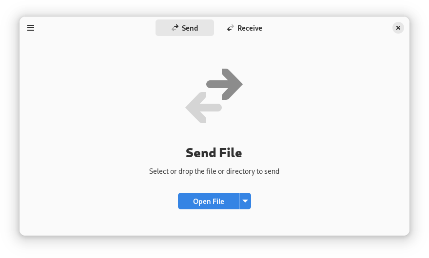

# Warp - Share files with each other effortlessly

Warp is designed to make it as simple and secure as possible to get files from one place to another. An internet 
connection is required.

The best transfer method will be determined using [Magic Wormhole](https://magic-wormhole.readthedocs.io/en/latest/)
which includes local network transfer if possible. Every file transfer is encrypted.

<div align="center">

</div>

## Flatpak

Flatpak is the recommended way to build and run Warp.

### Build

Make sure you have `flatpak` and `flatpak-builder` installed. Then run the commands below.

```shell
flatpak remote-add --user --if-not-exists flathub https://dl.flathub.org/repo/flathub.flatpakrepo
flatpak install --user org.gnome.Sdk//42 org.freedesktop.Sdk.Extension.rust-stable//21.08 org.gnome.Platform//42
cd build-aux
flatpak-builder --user app net.felinira.warp.Devel.json
```

### Run

Once the project is built, run the command below.

```shell
flatpak-builder --run app net.felinira.warp.Devel.json warp
```

### Install

After installing the dependencies you can build and install with this command:

```shell
cd build-aux
flatpak-builder --install --user app net.felinira.warp.Devel.json warp --force-clean 
```

## Meson

It is supported to install the project locally without flatpak.

```shell
meson build
cd build
ninja
sudo ninja install
```

To uninstall:

```shell
cd build
ninja uninstall
```

It is required to test any big changes with flatpak before contributing any new code.

# Contributing
See the [Contribution guide](./CONTRIBUTING.md) on how to contribute to the project

# Attribution
<p>App icon by <a href="https://svgrepo.com">svgrepo.com</a></p>
<p>Symbolic icon made from <a href="http://www.onlinewebfonts.com/icon">Icon Fonts</a> is licensed by CC BY 3.0</p>
