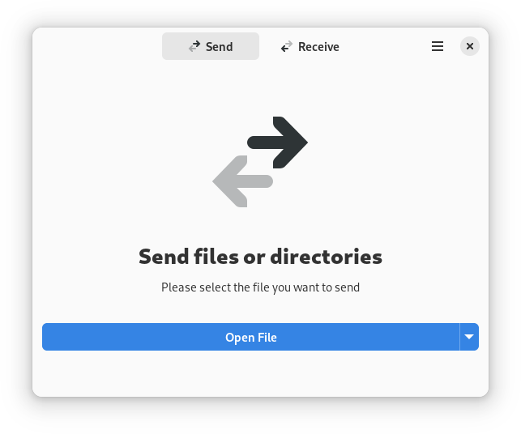

# Warp - Send files between places effortlessly

Warp is designed to make it as simple and secure as possible to get files from one place to another. An internet 
connection is required.

The best transfer method will be determined using [Magic Wormhole](https://magic-wormhole.readthedocs.io/en/latest/)
which includes local network transfer if possible. Every file transfer will be encrypted.

<div align="center">

</div>

## Building the project

Make sure you have `flatpak` and `flatpak-builder` installed. Then run the commands below.

```
flatpak install org.gnome.Sdk//41 org.freedesktop.Sdk.Extension.rust-stable//21.08 org.gnome.Platform//41
flatpak-builder --user flatpak_app build-aux/net.felinira.warp.Devel.json
```

## Running the project

Once the project is built, run the command below.

```
flatpak-builder --run flatpak_app build-aux/net.felinira.warp.Devel.json warp
```

# Attribution
App Icon: Icon by <a href="svgrepo.com">svgrepo.com</a>
Symbolic icon: <div>Icon made from <a href="http://www.onlinewebfonts.com/icon">Icon Fonts</a> is licensed by CC BY 3.0</div>
